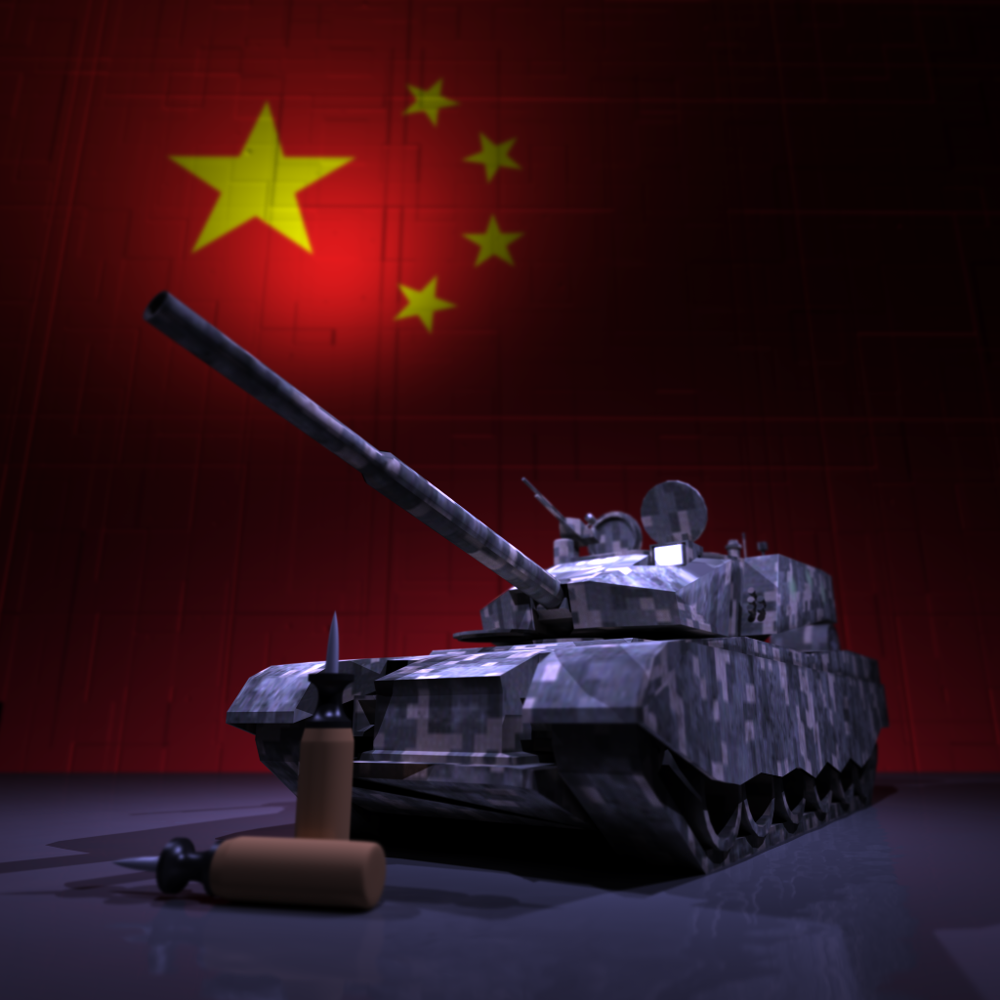
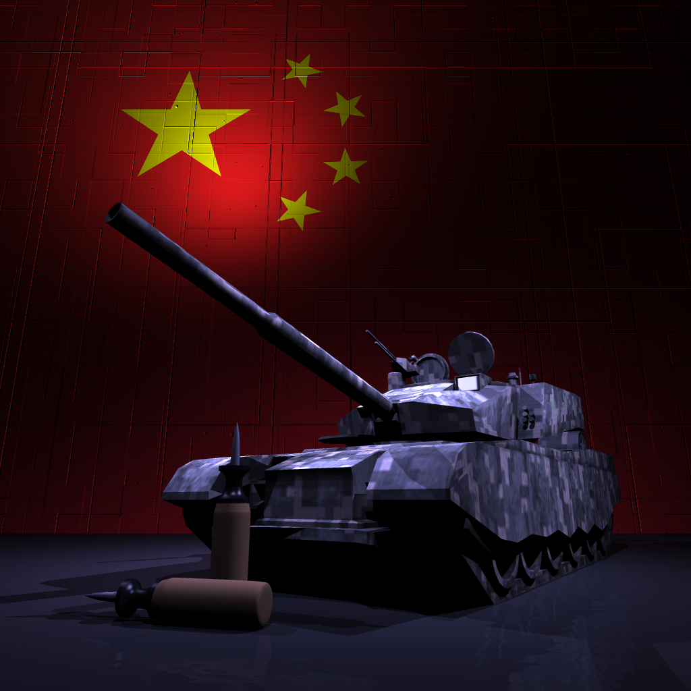

# Light Renderer

This is the project of Computer Graphics, THU: a light renderer based on ray tracing and path tracing.

## Results








## Run the Code

`deps/` are the dependencies of vector arithmetic.

`include/` contains the definitions of classes and functions.

`src/` contains the implementation of core functions.

To run all the cases above, use command 

```
bash run_all.sh
```
You can also specify some cases in `run_all.sh`.
